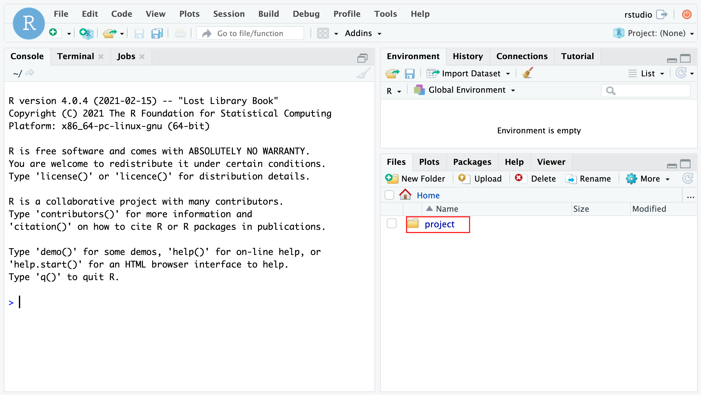

# Reproducible Clinical Research Project Template based on TRACE-RM

Author: Lukas Huber <a href="https://orcid.org/0000-0001-5443-0290
">

https://orcid.org/0000-0001-5443-0290
</a>

## Context
This template can serve as common starting point for traceable analyses in observational clinical research.

The projects created with this template should be:

- Versioned
- Identified
- Linked
- Documented
- Tested
- FAIR

The user should utilize R and Tidyverse.

The figure shows the main elements one may and should use to address the main needs of technical setup, in order to get a project up and running, follow the [Getting started guide](https://g4challenge.github.io/repro-fair-neuro-ds-template/articles/getting_started.html)

### [TRACE-RM](https://g4challenge.github.io/repro-fair-neuro-ds-template/articles/trace-rm.html)

## Documentation
[GitHub Pages pkgdown](https://g4challenge.github.io/repro-fair-neuro-ds-template/)

This template sets up a reproducible, aimed at FAIR environment for data science. It is possible to use it in different levels of reproducibility. It uses Docker, R, RMarkdown, Git, drake, mandrake, pkgdown, roxygen, roxytest and Github Actions.

The template is aimed at collaborators with technical and non-technical backgrounds, while the minimum requirement to run it, is having docker installed.

In order to document the Clinical Setting - this template recommends to follow the [STROBE Statement](https://strobe-statement.org/index.php?id=strobe-home) and fill out the following items first:

- Background Rationale(STROBE02)
- Objectives (STROBE03)
- Study Design (STROBE04) 
- Setting (STROBE05) 
- Participants (STROBE06)
- Variables (STROBE07)
- Data Sources/Measurement (STROBE08)

## Process

The project template recommends following a defined process with phases plan, action, validation, organization and curation.

Use the `pull_request_template.md` file to allow collaborators for a standard approach in approaching the merge requests.

## Dataset(s)
Description of data provenance and history goes here.

The template is configured to store data within the code repository in the folder `data`.

## Code

The code of this repsoitory resides in a git-version controlled repository and utilizes tests with testthat and roxytest.

[reproducibleFairTemplate - GitHub](https://github.com/g4challenge/repro-fair-neuro-ds-template)

Good Code Style should be enforced using e.g. `lintr:::addin_lint_package()`.

## Execution - Reproduction steps

In order to reproduce the results from the template and example scenarios, you need to have docker installed on your machine.

[repro-fair-neuro-ds-template - Dockerhub](https://hub.docker.com/repository/docker/g4challenge/repro-fair-neuro-ds-template)

First get the image built within this repository, as it contains all dependencies and elements used within this work:

`docker pull docker.io/g4challenge/repro-fair-neuro-ds-template`

After the download is completed, the container of the image can be started using:

`docker run -e PASSWORD=12345 -p 8787:8787 docker.io/g4challenge/repro-fair-neuro-ds-template` 

Then open your browser and enter the address http://localhost:8787. Use user `rstudio` and the set PASSWORD (e.g. `12345`) to log into the environment.

Open the project and project file (red rectangle) to launch the project.

The statistical methods are denoted as drake specification. The analysis is traceable and computationally reproducable. 

The main specification is found in [drake_spec](https://g4challenge.github.io/repro-fair-neuro-ds-template/articles/drake_specification.html)

The run of `vignettes/scenario_1.Rmd` - can be tested with the output and history.

Thereby, it is testable, if the results, the versioned drake history, and a new run result in the same results.
    
## Results
The research results have associated generated metadata, which can be displayed as HTML or are available as JSON.

- [reproducible-fair-ROCrate](https://g4challenge.github.io/repro-fair-neuro-ds-template/reference/figures/ro-crate-preview.html)
- [reproducible-fair-ROCrate-JSON](https://g4challenge.github.io/repro-fair-neuro-ds-template/reference/figures/ro-crate-metadata.json)

Further, the results are archived and stored as zip on Zenodo:

- [Zenodo repro-Fair-Neuro](https://zenodo.org/record/4015127)
    
## Additional Remarks

Description of data structures, documentation, requirements and publications.

Elements the user should be familiar with:
- Git
- Git(-hub/-lab)
- R(markdown)
- [Tidyverse](https://www.tidyverse.org/)
- [drake](https://books.ropensci.org/drake/)

Alternatives and extensions:
- [https://github.com/End-to-end-provenance](https://github.com/End-to-end-provenance) - rdtlite is used to generate PROV information.
- [targets](https://docs.ropensci.org/targets/) - successor of drake.
- [NeuroShapes](https://github.com/INCF/neuroshapes) INCF neuroshapes for defined data format - Common Data model.
