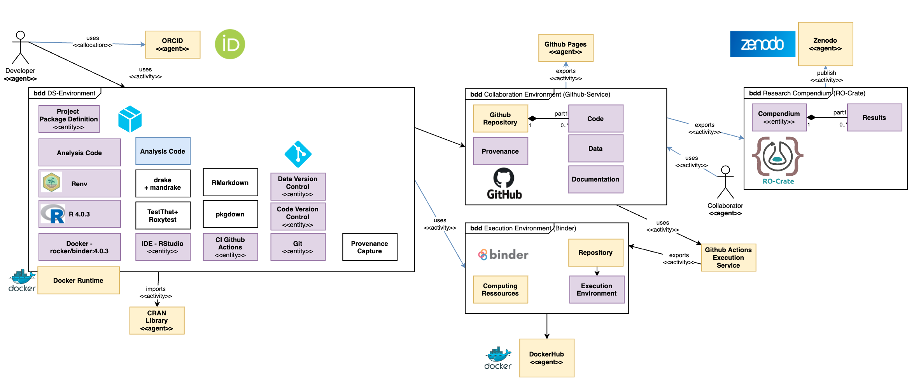

# Reproducible Clinical Research Project Template based on  -RM

[](https://zenodo.org/badge/latestdoi/284042245)

[](https://mybinder.org/v2/gh/g4challenge/repro-fair-neuro-ds-template/HEAD?urlpath=%3Frstudio)

[](https://codecov.io/gh/g4challenge/repro-fair-neuro-ds-template)
[](https://github.com/g4challenge/repro-fair-neuro-ds-template/actions)


Author: Lukas Huber <a href="https://orcid.org/0000-0001-5443-0290
">

https://orcid.org/0000-0001-5443-0290
</a>

## Context
This template can serve as common starting point for traceable analyses in observational clinical research.




### [TRACE-RM](docs/articles/trace-rm.html)

## Documentation
[GitHub Pages pkgdown](https://g4challenge.github.io/repro-fair-neuro-ds-template/)


This template sets up a reproducible, aimed at FAIR environment for data science. It is possible to use it in different levels of reproducibility. It uses Docker, R, RMarkdown, Git, drake, mandrake, pkgdown, roxygen, roxytest and Github Actions.

The template is aimed at collaborators with technical and non-technical backgrounds, while the minimum requirement to run it, is having docker installed.

Background Rationale(STROBE02)
Objectives (STROBE03)
Study Design (STROBE04) 
Setting (STROBE05) 
Participants (STROBE06)

Variables (STROBE07)

Data Sources/Measurement (STROBE08)

## Process

## (Next) Steps
Description of the next analysis steps. How to use this package:

1. start by cloning/forking the git repository
2. use git+github, git lfs, tidyverse and RMarkdown
3. add Drake Plans to for your Pipeline(s)
4. (optional) start the RStudio IDE within Docker + use renv


## Dataset(s)
Description of data provenance and history goes here.


## Code
[GitHub reproducibleFairTemplate](https://github.com/g4challenge/repro-fair-neuro-ds-template)

## Execution - Dev-Steps Getting Started (technical)

[repro-fair-neuro-ds-template Dockerhub](https://hub.docker.com/repository/docker/g4challenge/repro-fair-neuro-ds-template)

Description of steps during development, starting with Docker + RStudio right away.

1. clone this template

```
git clone https://github.com/g4challenge/repro-fair-neuro-ds-template
```

2. within the git repository, start the docker container:

```
docker run --rm -p 8787:8787 -e PASSWORD="1234" -v $(pwd):/home/rstudio my_fair_project 
```

3. open your browser at http://localhost:8787 

4. login using user=`rstudio` password=`1234`

5. click open on the .rproj file.

6. Start using the project, adapt it to your needs + change the git remote


- Local Docker build
    
    docker build . -t my_fair_project

- Local Docker run with default user `rstudio` and PASSWORD="1234" - use different password

```
docker run --rm -p 8787:8787 -e PASSWORD="1234" -v $(pwd):/home/rstudio g4challenge/repro-fair-neuro-ds-template
```

The statistical methods are denoted as drake specification. The analysis is traceable and computationally reproducable. 

The main specification is found in [drake_spec](drake_spec.Rmd)
    
## Results

[ROCrate](../ro-crate-preview.html)
    
## Additional Remarks

Description of data structures, documentation, requirements and publications.

Elements the user should be familiar with:
- Git
- Git(-hub/-lab)
- R(markdown)
- Tidyverse
- [drake](https://books.ropensci.org/drake/)

Alternatives:
- https://github.com/End-to-end-provenance


[ ] https://github.com/INCF/neuroshapes
