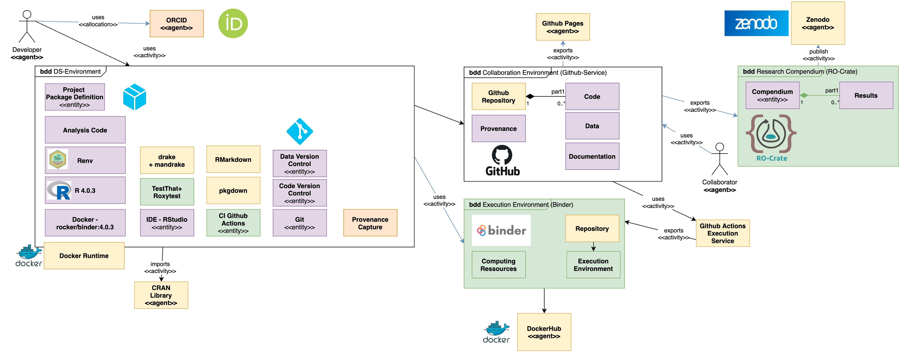

# Reproducible Clinical Research Project Template based on  -RM

Author: Lukas Huber <a href="https://orcid.org/0000-0001-5443-0290
">

https://orcid.org/0000-0001-5443-0290
</a>

## Context
This template can serve as common starting point for traceable analyses in observational clinical research.

The user should utilize R and Tidyverse.

The figure shows the main elements one may and should use to address the main needs of technical setup, in order to get a project up and running, follow the [Getting started guide](https://g4challenge.github.io/repro-fair-neuro-ds-template/articles/getting_started.html)

### [TRACE-RM](https://g4challenge.github.io/repro-fair-neuro-ds-template/articles/trace-rm.html)

## Documentation
[GitHub Pages pkgdown](https://g4challenge.github.io/repro-fair-neuro-ds-template/)

This template sets up a reproducible, aimed at FAIR environment for data science. It is possible to use it in different levels of reproducibility. It uses Docker, R, RMarkdown, Git, drake, mandrake, pkgdown, roxygen, roxytest and Github Actions.

The template is aimed at collaborators with technical and non-technical backgrounds, while the minimum requirement to run it, is having docker installed.

In order to document the Clinical Setting - this template recommends to follow the [STROBE Statement](https://strobe-statement.org/index.php?id=strobe-home) and fill out the following items first:

- Background Rationale(STROBE02)
- Objectives (STROBE03)
- Study Design (STROBE04) 
- Setting (STROBE05) 
- Participants (STROBE06)
- Variables (STROBE07)
- Data Sources/Measurement (STROBE08)

## Process

## (Next) Steps

Getting Started
Description of the next analysis steps. How to use this package:

1. start by cloning/forking the git repository
2. use git+github, git lfs, tidyverse and RMarkdown
3. add Drake Plans to for your Pipeline(s)
4. (optional) start the RStudio IDE within Docker + use renv

## Dataset(s)
Description of data provenance and history goes here.

The template is configured to store data within the code repository in the folder `data`.

## Code

[reproducibleFairTemplate - GitHub](https://github.com/g4challenge/repro-fair-neuro-ds-template)

## Execution - Reproduction steps

In order to reproduce the results from the template and example scenarios, you need to have docker installed on your machine.

[repro-fair-neuro-ds-template - Dockerhub](https://hub.docker.com/repository/docker/g4challenge/repro-fair-neuro-ds-template)

First get the image built within this repository, as it contains all dependencies and elements used within this work:

`docker pull g4challenge/repro-fair-neuro-ds-template`

After the download is completed, the container of the image can be started using:

`docker run -e PASSWORD=12345 -p 8787:8787 docker.io/g4challenge/repro-fair-neuro-ds-template` 

Then open your browser and enter the address http://localhost:8787. Use user `rstudio` and the set PASSWORD (e.g. `12345`) to log into the environment.

Open the project and project file (red rectangle) to launch the project.

The statistical methods are denoted as drake specification. The analysis is traceable and computationally reproducable. 

The main specification is found in [drake_spec](https://g4challenge.github.io/repro-fair-neuro-ds-template/articles/drake_specification.html)
    
## Results
The research results have associated generated metadata, which can be displayed as HTML or are available as JSON.

- [reproducible-fair-ROCrate](../vignettes/ro-crate-preview.html)
- [reproducible-fair-ROCrate-JSON](../vignettes/ro-crate-metadata.json)
    
## Additional Remarks

Description of data structures, documentation, requirements and publications.

Elements the user should be familiar with:
- Git
- Git(-hub/-lab)
- R(markdown)
- [Tidyverse](https://www.tidyverse.org/)
- [drake](https://books.ropensci.org/drake/)

Alternatives:
- https://github.com/End-to-end-provenance
- [targets](https://docs.ropensci.org/targets/) - successor of drake.

[ ] https://github.com/INCF/neuroshapes
