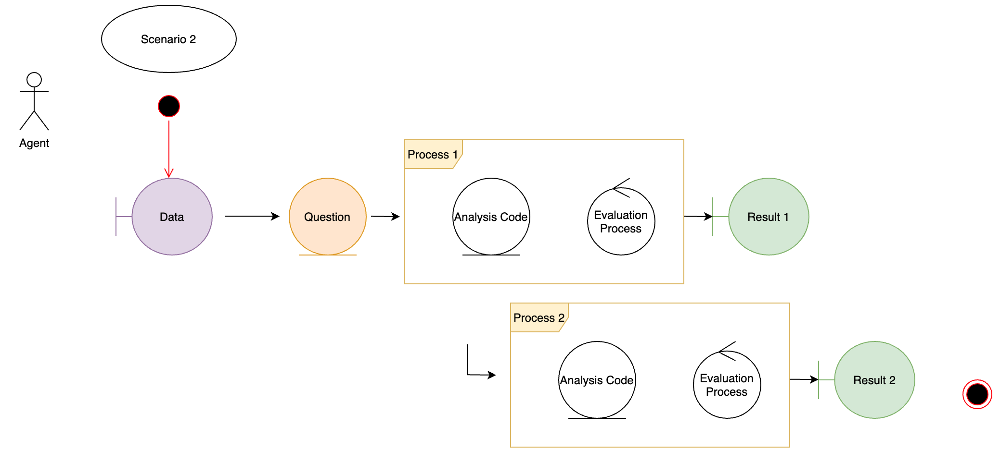

This notebook handles the rendering of scenario_2 - which is a simple case of a hypotheses - import dataset - transform dataset - generate report and evaluate the process and result.



Additionally, this scenario tests "randomness" and the reproducibility and  traceability of seeds in across different environments and runtimes.

The main aim of scenario_2 is to demonstrate "randomness" and it's traceability. Therefore the second processing step added to scenario 1 will "sample" and validate the extracted random number statically.

```{r setup}
knitr::opts_knit$set(root.dir = rprojroot::find_rstudio_root_file())
```

# Question

The simulated hypotheses is to generate a CPP(cerebral perfusion pressure) based on raw_data. The following chunk instantiates packages, functions and plans.

```{r}
pkgload::load_all()
#source("R/packages.R")
#source("R/functions.R")
#source("R/functions_scenario_2.R")
#source("R/plan.R")
```

In order to avoid errors - the drake cache is cleaned.

```{r eval=F}
#drake::clean()
# check file existing
#file.exists("data/raw_data.xlsx")
```

The `scenario_wrapper`-function returns the instantiated scenario_1 drake "tibble".

```{r eval=F}
drake::make(scenario_wrapper())
```

```{r eval=F}
drake_history()
```

```{r eval=F}
vis_drake_graph(scenario_wrapper())
```

## Validation of randomness:

Multiple results of the resampled CPP values are documented here:

- Operating Systems: Macos vs Linux (Docker)
- R-Versions: 4.0.2 vs 4.0.5
- Package upgrades

The aim is, that the resampled results are compared and validated if a migration can be considered safe.

```{r eval=F}
loadd(sc2_random1)
sc2_random1
```

```{r eval=F}
testthat::test_that("sc2_random1 contains the reproducible correct sample", {
  testthat::expect_equal(sc2_random1$cpp[1], 89.5938261130521)
})
```

This test is included within the testthat folder as automated reference testing. Test upgrade protocols were succesfull on the stated R Version Upgrade, the Docker Comparison and Package upgrades.


