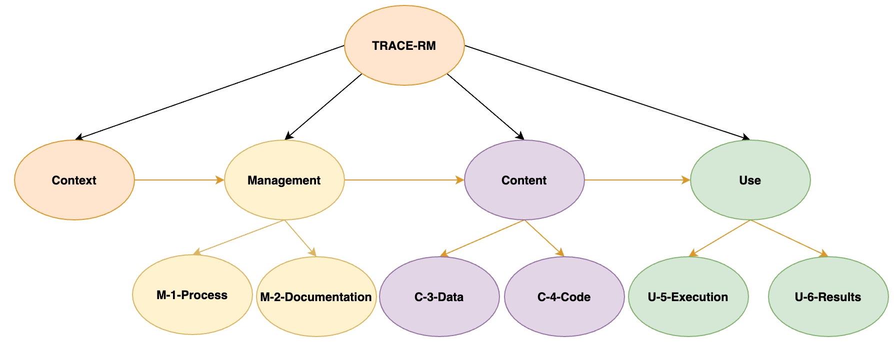

This traceability reference model **TRACE-RM** is based upon [W3C PROV](https://www.w3.org/TR/prov-overview/) principles with the scope of traceability of observational neuro-intensive care research. It focuses on computational reproducibility of analytic approaches.

The main elements are defined by above's figure and described hereby as excerpt of the author (Lukas Huber <a href="https://orcid.org/0000-0001-5443-0290">https://orcid.org/0000-0001-5443-0290</a>) dissertation.

